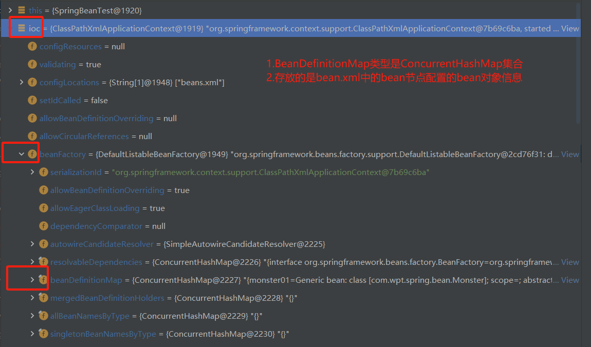
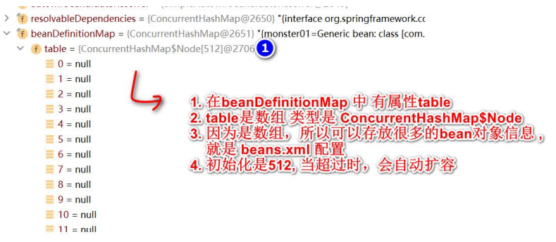
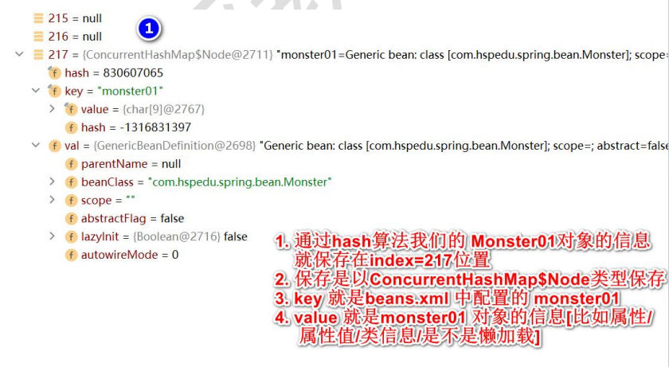
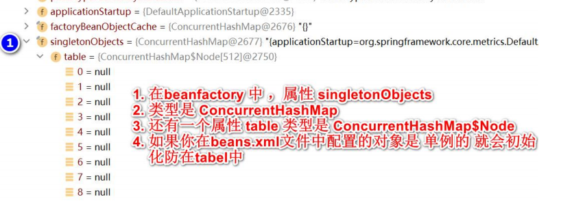
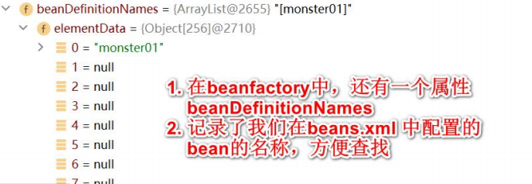
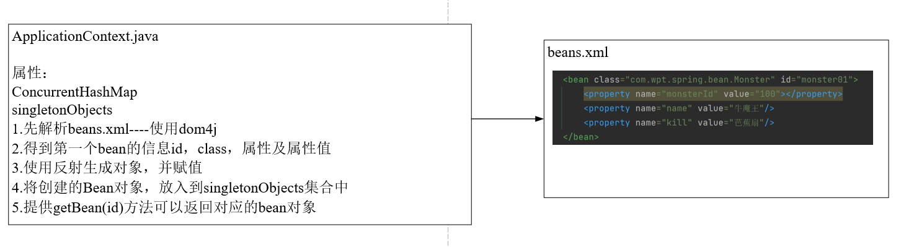
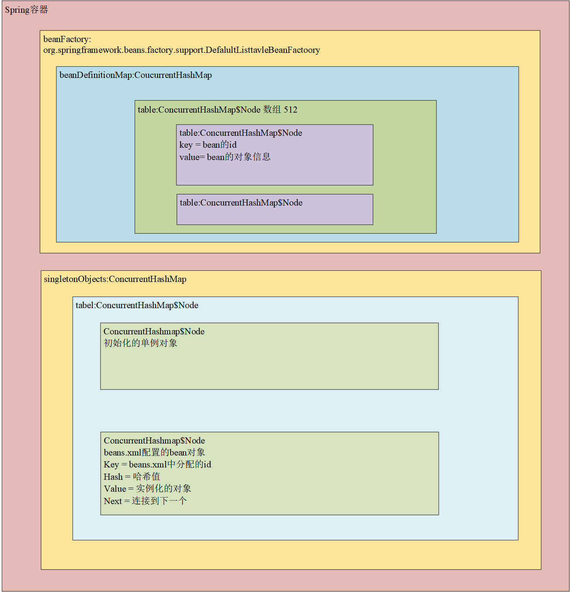
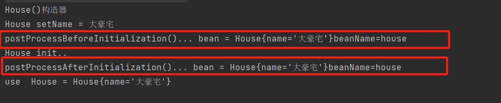

# 1 Spring核心概念

## 1.1 核心概念

IOC（Inversion Of Control）：反转控制，可以管理Java对象。

DI(Dependency Injection)：依赖注入，可以理解为IOC的另一种叫法

AOP：切面编程

JDBCTemplate：Spring提供的一套可以访问数据库的技术

声明式事务：基于IOC/AOP实现事务管理

## 1.2 IOC原理

（1）Spring根据配置文件xml或者注解，创建对象，并放入容器（ConcurrentHashMap）中，并且可以完成对象之间的依赖

（2）当需要使用某个对象实例时，直接从容器中获取

（3）更加关注如何使用对象完成对应的业务

## 1.3 Spring容器结构

简单的实现机制：












## 1.4 实现基于XML的简单配置程序

### 1.4.1 实现思路



## 1.5 Spring原生容器底层机构梳理



## 1.6 Spring配置/管理Bean

### 1.6.1 Bean管理

#### 1.6.1.1 Bean的单例和多例

Spring 的IoC容器默认是按照单例创建的，即配置一个bean对象后，IoC容器只会创建一个bean实例

如果想要多个实例形式创建Bean，可以通过配置scope="prototype"

```xml
<!--   配置Cat对象-->
    <!--    1.在默认情况下，scope属性是  singleton  在IoC容器中，只有一个bean对象-->
    <!--    2.每次执行getBean返回的都是同一个对象-->
    <!--    3.如果希望每次返回的都不是同一个对象，可以配置scope-->

    <bean id="cat" class="com.wpt.spring.bean.Cat" scope="prototype">
       <property name="name" value="小花猫"/>
       <property name="id" value="100"/>
   </bean>	
```

### 1.6.2 Bean配置

------

#### 1.6.2.**1 通过类型获取bean**

<font color="red">要求ioc容器中同一类的Bean只有一个，否则会抛出异常  NoUniqueBeanDefinitionException</font>  

```xml
<!--   配置monster，通过类型获取-->
    <bean class="com.wpt.spring.bean.Monster">
        <!--给某个bean对象赋值时，是使用对应的setter方法完成的-->
        <!--缺少对应的setter方法会报错-->
        
        <property name="monsterId" value="100"/>
        <property name="name" value="牛魔王"/>
        <property name="kill" value="芭蕉扇"/>
    </bean>
```

```java
 @Test
    public  void getBeanByType(){
        // 1.创建容器 ApplicationContext
        // 2.该容器和容器配置文件关联
        ClassPathXmlApplicationContext ioc = new ClassPathXmlApplicationContext("beans.xml");
        // 3.直接传入class对象
        Monster bean = ioc.getBean(Monster.class);
    }
```

#### **1.6.2.**2 通过制定构造器配置Bean

<font color="red">constructor-arg 标签可以指定使用构造器的参数</font>

<font color="red">index表示构造器的第几个参数，从0开始计算。除了index还可以使用name、type进行指定</font>

```xml
 <bean class="com.wpt.spring.bean.Monster" id="monster03">
        
        <constructor-arg value="200" name="monsterId"/>
        <constructor-arg value="白骨精" index="1"/>
        <constructor-arg value="吸人血" index="2"/>
     
<!--        <constructor-arg value="200" type="java.lang.Integer"/>-->
<!--        <constructor-arg value="白骨精" type="java.lang.String"/>-->
<!--        <constructor-arg value="吸人血" type="java.lang.String"/>-->
  
    </bean>
```

#### **1.6.2.**3 通过p名称配置

```xml
<bean class="com.wpt.spring.bean.Monster" id="monster06"
          p:monsterId = "500"
          p:name="红孩儿"
          p:kill="吐火"
    />
```

#### 1.6.2.4 引用、注入其他bean--ref

<font color="red">**体现出了Spring的依赖注入**</font>

```xml
 <!--    配置memberDao对象-->
    <bean class="com.wpt.spring.dao.MemberDaoImpl" id="memberDao"/>
    <!--    配置memberService对象-->
    <!--    ref = "memberDao" 表示 memberService 对象属性 memberDao 引用的对象是 id = memberDao 的对象-->
    <bean class="com.wpt.spring.service.MemberServiceImpl" id="memberService">
        <property name="memberDao" ref="memberDao"/>
    </bean>
```

#### 1.6.2.5 通过内部Bean配置属性

```xml
 <!--    配置memberService对象  使用内部bean-->
    <bean class="com.wpt.spring.service.MemberServiceImpl" id="memberService2">
        <!--直接配置一个内部Bean-->
        <property name="memberDao">
            <bean class="com.wpt.spring.dao.MemberDaoImpl"/>
        </property>
    </bean>
```

#### 1.6.2.6 注入集合、数组类型

给List赋值

```xml
<!--    配置Master对象-->
    <bean class="com.wpt.spring.bean.Master" id="master">
        <property name="name" value="太上老君"/>
        <property name="monsterList">
            <list>
                <ref bean="monster03"/>
                <ref bean="monster06"/>
                <bean class="com.wpt.spring.bean.Monster" id="monster2">
                    <property name="name" value="老鼠精"/>
                    <property name="kill" value="吃粮食"/>
                    <property name="monsterId" value="100"/>
                </bean>
            </list>
        </property>
    </bean>
```

给Map属性配置

```xml
<bean class="com.wpt.spring.bean.Master" id="master">
        <property name="name" value="太上老君"/>
        <property name="monsterMap">
            <map>
                <entry>
                    <key>
                        <value>monster001</value>
                    </key>
                    <ref bean="monster2"/>
                </entry>
                <entry>
                    <key>
                        <value>monster002</value>
                    </key>
                    <ref bean="monster"/>
                </entry>
                <entry>
                    <key>
                        <value>monster003</value>
                    </key>
                    <ref bean="monster06"/>
                </entry>
            </map>
        </property>
    </bean>
```

**给数组属性赋值**

```xml
    <bean class="com.wpt.spring.bean.Master" id="master">
        <property name="name" value="太上老君"/>        
        <property name="monsterName">
            <array>
                <value>小妖怪</value>
                <value>大妖怪</value>
                <value>老妖怪</value>
            </array>
        </property>
    </bean>
```

**对Properties属性赋值**

```xml
 <bean class="com.wpt.spring.bean.Master" id="master">
        <property name="name" value="太上老君"/>
        <property name="pros">
            <props>
                <prop key="username">root</prop>
                <prop key="password">123456</prop>
                <prop key="ip">127.0.0.1</prop>
            </props>
        </property>
    </bean>
```

#### 1.6.2.7 通过utils进行配置

```xml
 <!--    配置BookStore-->
    <!--    定义一个util：list-->
    <util:list id="bookList">
        <value>三国演义</value>
        <value>水浒传</value>
        <value>红楼梦</value>
        <value>西游记</value>
    </util:list>
    <bean class="com.wpt.spring.bean.BookStore" id="bookStore">
        <property name="bookList" ref="bookList"/>
    </bean>
```

#### 1.6.2.8 级联对象属性赋值

```xml
<!--    配置dept对象-->
    <bean class="com.wpt.spring.bean.Dept" id="dept"/>
    <!--    配置employee对象-->
    <bean class="com.wpt.spring.bean.Employee" id="employee">
        <property name="name" value="jack"/>
        <property name="dept" ref="dept"/>
        <property name="dept.name" value="研发部"/>
    </bean>
```

#### 1.6.2.9 通过静态工厂获取Bean

静态工厂

```java
public class MyStaticFactory {
    private static Map<String, Monster> monsterMap;

    //使用static代码块初始化
    static {
        monsterMap = new HashMap<>();
        monsterMap.put("monster01",new Monster(100,"牛魔王","芭蕉扇"));
        monsterMap.put("monster02",new Monster(200,"孙悟空","七十二变"));
    }
    public static Monster getMonster(String key){
        return monsterMap.get(key);
    }
}	
```

```xml
  <!--    配置Monster对象，通过静态工厂获取
		1.class 是静态工厂类的全路径
		2.factory-method是指定静态工厂类的哪个方法返回对象
		3.constructor-arg value="monster02" 指定要返回静态工厂的哪个对象
-->
    <bean class="com.wpt.spring.Factory.MyStaticFactory" id="myStaticBean" factory-method="getMonster">
        <constructor-arg value="monster02"/>
    </bean>
```

#### 1.6.2.10 通过实例工厂获取Bean

实例工厂

```java
public class MyInstanceFactory {
    private Map<String, Monster> monsterMap;
    //通过普通代码块进行初始化
    {
        monsterMap = new HashMap<>();
        monsterMap.put("monster01",new Monster(100,"牛魔王","芭蕉扇"));
        monsterMap.put("monster02",new Monster(200,"孙悟空","七十二变"));
        monsterMap.put("monster03",new Monster(200,"红孩儿","喷火"));
    }

    public Monster getMonster(String key){
        return monsterMap.get(key);
    }
}
```

```xml
<!--    配置Monster对象，通过实例工厂获取-->
    <bean id="myInstanceFactory" class="com.wpt.spring.factory.MyInstanceFactory"/>
    <bean id="my_monster02" factory-method="getMonster" factory-bean="myInstanceFactory">
        <constructor-arg value="monster03"></constructor-arg>
    </bean>
```

#### 1.6.2.11 通过BeanFactory获取Bean

（1）继承FactoryBean接口

（2）实现getObject()、getObjectType()、isSingleton()方法

（3）配置Spring的xml文件

#### 1.6.2.12 Bean配置信息重用（继承）

```xml
<bean id="monster10" class="com.wpt.spring.bean.Monster">
        <property name="monsterId" value="100"/>
        <property name="name" value="牛魔王"/>
        <property name="kill" value="芭蕉扇"/>
    </bean>
    <!--    配置Monster对象，但是对象的属性值和id=monster10的一样-->
	<!--指定当前配置的对象的属性值，从id=monster10的对象拿-->
    <bean parent="monster10" class="com.wpt.spring.bean.Monster"/>
```

#### 1.6.2.13 通过属性文件给Bean注入值

添加配置文件my.properties

```properties
name=\u9EC4\u888D\u602A
monsterID=10
kill=\u72EE\u5B50\u543C
```

配置Spring容器的XML文件

```xml
  <!--    指定属性文件位置-->
    <context:property-placeholder location="classpath:my.properties"/>
    <!--    配置Monster对象-->
    <bean class="com.wpt.spring.bean.Monster" id="master1000">
        <property name="monsterId" value="${monsterID}"/>
        <property name="name" value="${name}"/>
        <property name="kill" value="${kill}"/>
    </bean>	
```


## 1.7 Bean的生命周期

bean的创建是由JVM完成的，执行如下方法：

(1) 执行构造器

(2) 执行set方法

(3) 调用bean的初始化方法(需要配置)

(4) 使用bean

(5) 当容器关闭时，调用bean的销毁方法(需要配置)

```xml
<!-- 演示Bean的生命周期 -->
    <!--
    1. init-method="init" 指定bean的初始化方法，在setter方法后执行
    2. 方法执行的时机，由Spring容器控制
    3. destroy-method="destroy" 指定bean的销毁方法，在容器关闭时执行
    4. 方法执行的时机，由Spring容器控制
    -->

    <bean class="com.wpt.spring.bean.House" id="house"
          init-method="init" destroy-method="destroy">
        <property name="name" value="北京豪宅"/>
    </bean>	
```

## 1.8 Bean的后置处理器

<font color = "red">**Bean的后置处理器可以在初始化方法调用前或者调用后被调用**</font>

(1) 实现BeanPostProcessor接口

(2) 实现postProcessAfterInitialization、postProcessBeforeInitialization方法，根据业务需要处理、修改bean对象

(3) 配置Spring容器的xml文件

```xml
<bean class="com.wpt.spring.bean.House" id="house"
          init-method="init" destroy-method="destroy" >
        <property name="name" value="大豪宅"/>
    </bean>
<!--Bean的后置处理器配置
1.当在Spring容器配置文件中，配置后置处理器MyBeanPostProcessor后
2.这时后置处理器对象，会作用在该容器下的所有Bean对象中
3.
-->
    <bean class="com.wpt.spring.bean.MyBeanPostProcessor" id="beanPostProcessor"/>
```



## 1.9 自动装配Bean

