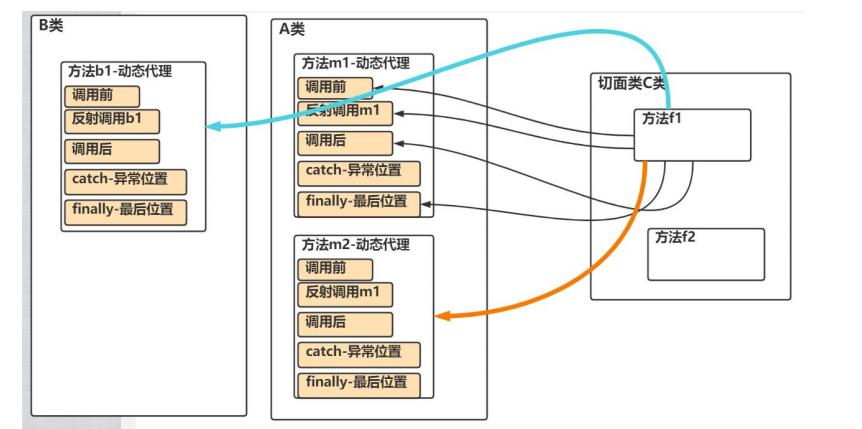

# 1 Spring核心概念

## 1.1 核心概念

IOC（Inversion Of Control）：反转控制，可以管理Java对象。

DI(Dependency Injection)：依赖注入，可以理解为IOC的另一种叫法

AOP：切面编程

JDBCTemplate：Spring提供的一套可以访问数据库的技术

声明式事务：基于IOC/AOP实现事务管理

## 1.2 IOC原理

（1）Spring根据配置文件xml或者注解，创建对象，并放入容器（ConcurrentHashMap）中，并且可以完成对象之间的依赖

（2）当需要使用某个对象实例时，直接从容器中获取

（3）更加关注如何使用对象完成对应的业务

## 1.3 Spring容器结构

简单的实现机制：


## 1.4 实现基于XML的简单配置程序

### 1.4.1 实现思路


## 1.5 Spring原生容器底层机构梳理


## 1.6 Spring配置/管理Bean

### 1.6.1 Bean管理

#### 1.6.1.1 Bean的单例和多例

Spring 的IoC容器默认是按照单例创建的，即配置一个bean对象后，IoC容器只会创建一个bean实例

如果想要多个实例形式创建Bean，可以通过配置scope="prototype"

```xml
<!--   配置Cat对象-->
    <!--    1.在默认情况下，scope属性是  singleton  在IoC容器中，只有一个bean对象-->
    <!--    2.每次执行getBean返回的都是同一个对象-->
    <!--    3.如果希望每次返回的都不是同一个对象，可以配置scope-->

    <bean id="cat" class="com.wpt.spring.bean.Cat" scope="prototype">
       <property name="name" value="小花猫"/>
       <property name="id" value="100"/>
   </bean>	
```

### 1.6.2 Bean配置

------

#### 1.6.2.**1 通过类型获取bean**

<font color="red">要求ioc容器中同一类的Bean只有一个，否则会抛出异常  NoUniqueBeanDefinitionException</font>  

```xml
<!--   配置monster，通过类型获取-->
    <bean class="com.wpt.spring.bean.Monster">
        <!--给某个bean对象赋值时，是使用对应的setter方法完成的-->
        <!--缺少对应的setter方法会报错-->
        
        <property name="monsterId" value="100"/>
        <property name="name" value="牛魔王"/>
        <property name="kill" value="芭蕉扇"/>
    </bean>
```

```java
 @Test
    public  void getBeanByType(){
        // 1.创建容器 ApplicationContext
        // 2.该容器和容器配置文件关联
        ClassPathXmlApplicationContext ioc = new ClassPathXmlApplicationContext("beans.xml");
        // 3.直接传入class对象
        Monster bean = ioc.getBean(Monster.class);
    }
```

#### **1.6.2.**2 通过制定构造器配置Bean

<font color="red">constructor-arg 标签可以指定使用构造器的参数</font>

<font color="red">index表示构造器的第几个参数，从0开始计算。除了index还可以使用name、type进行指定</font>

```xml
 <bean class="com.wpt.spring.bean.Monster" id="monster03">
        
        <constructor-arg value="200" name="monsterId"/>
        <constructor-arg value="白骨精" index="1"/>
        <constructor-arg value="吸人血" index="2"/>
     
<!--        <constructor-arg value="200" type="java.lang.Integer"/>-->
<!--        <constructor-arg value="白骨精" type="java.lang.String"/>-->
<!--        <constructor-arg value="吸人血" type="java.lang.String"/>-->
  
    </bean>
```

#### **1.6.2.**3 通过p名称配置

```xml
<bean class="com.wpt.spring.bean.Monster" id="monster06"
          p:monsterId = "500"
          p:name="红孩儿"
          p:kill="吐火"
    />
```

#### 1.6.2.4 引用、注入其他bean--ref

<font color="red">**体现出了Spring的依赖注入**</font>

```xml
 <!--    配置memberDao对象-->
    <bean class="com.wpt.spring.dao.MemberDaoImpl" id="memberDao"/>
    <!--    配置memberService对象-->
    <!--    ref = "memberDao" 表示 memberService 对象属性 memberDao 引用的对象是 id = memberDao 的对象-->
    <bean class="com.wpt.spring.service.MemberServiceImpl" id="memberService">
        <property name="memberDao" ref="memberDao"/>
    </bean>
```

#### 1.6.2.5 通过内部Bean配置属性

```xml
 <!--    配置memberService对象  使用内部bean-->
    <bean class="com.wpt.spring.service.MemberServiceImpl" id="memberService2">
        <!--直接配置一个内部Bean-->
        <property name="memberDao">
            <bean class="com.wpt.spring.dao.MemberDaoImpl"/>
        </property>
    </bean>
```

#### 1.6.2.6 注入集合、数组类型

给List赋值

```xml
<!--    配置Master对象-->
    <bean class="com.wpt.spring.bean.Master" id="master">
        <property name="name" value="太上老君"/>
        <property name="monsterList">
            <list>
                <ref bean="monster03"/>
                <ref bean="monster06"/>
                <bean class="com.wpt.spring.bean.Monster" id="monster2">
                    <property name="name" value="老鼠精"/>
                    <property name="kill" value="吃粮食"/>
                    <property name="monsterId" value="100"/>
                </bean>
            </list>
        </property>
    </bean>
```

给Map属性配置

```xml
<bean class="com.wpt.spring.bean.Master" id="master">
        <property name="name" value="太上老君"/>
        <property name="monsterMap">
            <map>
                <entry>
                    <key>
                        <value>monster001</value>
                    </key>
                    <ref bean="monster2"/>
                </entry>
                <entry>
                    <key>
                        <value>monster002</value>
                    </key>
                    <ref bean="monster"/>
                </entry>
                <entry>
                    <key>
                        <value>monster003</value>
                    </key>
                    <ref bean="monster06"/>
                </entry>
            </map>
        </property>
    </bean>
```

**给数组属性赋值**

```xml
    <bean class="com.wpt.spring.bean.Master" id="master">
        <property name="name" value="太上老君"/>        
        <property name="monsterName">
            <array>
                <value>小妖怪</value>
                <value>大妖怪</value>
                <value>老妖怪</value>
            </array>
        </property>
    </bean>
```

**对Properties属性赋值**

```xml
 <bean class="com.wpt.spring.bean.Master" id="master">
        <property name="name" value="太上老君"/>
        <property name="pros">
            <props>
                <prop key="username">root</prop>
                <prop key="password">123456</prop>
                <prop key="ip">127.0.0.1</prop>
            </props>
        </property>
    </bean>
```

#### 1.6.2.7 通过utils进行配置

```xml
 <!--    配置BookStore-->
    <!--    定义一个util：list-->
    <util:list id="bookList">
        <value>三国演义</value>
        <value>水浒传</value>
        <value>红楼梦</value>
        <value>西游记</value>
    </util:list>
    <bean class="com.wpt.spring.bean.BookStore" id="bookStore">
        <property name="bookList" ref="bookList"/>
    </bean>
```

#### 1.6.2.8 级联对象属性赋值

```xml
<!--    配置dept对象-->
    <bean class="com.wpt.spring.bean.Dept" id="dept"/>
    <!--    配置employee对象-->
    <bean class="com.wpt.spring.bean.Employee" id="employee">
        <property name="name" value="jack"/>
        <property name="dept" ref="dept"/>
        <property name="dept.name" value="研发部"/>
    </bean>
```

#### 1.6.2.9 通过静态工厂获取Bean

静态工厂

```java
public class MyStaticFactory {
    private static Map<String, Monster> monsterMap;

    //使用static代码块初始化
    static {
        monsterMap = new HashMap<>();
        monsterMap.put("monster01",new Monster(100,"牛魔王","芭蕉扇"));
        monsterMap.put("monster02",new Monster(200,"孙悟空","七十二变"));
    }
    public static Monster getMonster(String key){
        return monsterMap.get(key);
    }
}	
```

```xml
  <!--    配置Monster对象，通过静态工厂获取
		1.class 是静态工厂类的全路径
		2.factory-method是指定静态工厂类的哪个方法返回对象
		3.constructor-arg value="monster02" 指定要返回静态工厂的哪个对象
-->
    <bean class="com.wpt.spring.Factory.MyStaticFactory" id="myStaticBean" factory-method="getMonster">
        <constructor-arg value="monster02"/>
    </bean>
```

#### 1.6.2.10 通过实例工厂获取Bean

实例工厂

```java
public class MyInstanceFactory {
    private Map<String, Monster> monsterMap;
    //通过普通代码块进行初始化
    {
        monsterMap = new HashMap<>();
        monsterMap.put("monster01",new Monster(100,"牛魔王","芭蕉扇"));
        monsterMap.put("monster02",new Monster(200,"孙悟空","七十二变"));
        monsterMap.put("monster03",new Monster(200,"红孩儿","喷火"));
    }

    public Monster getMonster(String key){
        return monsterMap.get(key);
    }
}
```

```xml
<!--    配置Monster对象，通过实例工厂获取-->
    <bean id="myInstanceFactory" class="com.wpt.spring.factory.MyInstanceFactory"/>
    <bean id="my_monster02" factory-method="getMonster" factory-bean="myInstanceFactory">
        <constructor-arg value="monster03"></constructor-arg>
    </bean>
```

#### 1.6.2.11 通过BeanFactory获取Bean

（1）继承FactoryBean接口

（2）实现getObject()、getObjectType()、isSingleton()方法

（3）配置Spring的xml文件

#### 1.6.2.12 Bean配置信息重用（继承）

```xml
<bean id="monster10" class="com.wpt.spring.bean.Monster">
        <property name="monsterId" value="100"/>
        <property name="name" value="牛魔王"/>
        <property name="kill" value="芭蕉扇"/>
    </bean>
    <!--    配置Monster对象，但是对象的属性值和id=monster10的一样-->
	<!--指定当前配置的对象的属性值，从id=monster10的对象拿-->
    <bean parent="monster10" class="com.wpt.spring.bean.Monster"/>
```

#### 1.6.2.13 通过属性文件给Bean注入值

添加配置文件my.properties

```properties
name=\u9EC4\u888D\u602A
monsterID=10
kill=\u72EE\u5B50\u543C
```

配置Spring容器的XML文件

```xml
  <!--    指定属性文件位置-->
    <context:property-placeholder location="classpath:my.properties"/>
    <!--    配置Monster对象-->
    <bean class="com.wpt.spring.bean.Monster" id="master1000">
        <property name="monsterId" value="${monsterID}"/>
        <property name="name" value="${name}"/>
        <property name="kill" value="${kill}"/>
    </bean>	
```

### 1.6.3 基于注解配置Bean

<font color="red">@Component 表示当前注解标识是一个组件</font>										

<font color="red">@Controller 表示当前注解是一个控制器，常用于Servlet</font>								

<font color="red">@Service 表示当前注解是一个业务逻辑处理类，通常用于Service类</font>				

<font color="red">@Respository 表示当前注解标识的是一个持久化层类，通常用于Dao类</font>

```xml
    <!--    配置容器需要扫描的包    
    1.component-scan 表示要对指定的包下面的类进行扫描，并创建对象到容器中
    2.base-package 表示指定要扫描的包是哪一个
    3.含义：当Spring容器创建/初始化时，会扫描base-package下的所有带有注解的类，将其实例化，生成对象，放入容器
    -->
    <context:component-scan base-package="com.wpt.spring.component"/>
```

**注意事项：**

(1) 可以通过通配符 * 指定扫描指定路径下的所有包

(2) 例如**<context:component-scan base-package="com.wpt.spring.component"/>**会扫描component包及其子包下的所有类

## 1.7 Bean的生命周期

bean的创建是由JVM完成的，执行如下方法：

(1) 执行构造器

(2) 执行set方法

(3) 调用bean的初始化方法(需要配置)

(4) 使用bean

(5) 当容器关闭时，调用bean的销毁方法(需要配置)

```xml
<!-- 演示Bean的生命周期 -->
    <!--
    1. init-method="init" 指定bean的初始化方法，在setter方法后执行
    2. 方法执行的时机，由Spring容器控制
    3. destroy-method="destroy" 指定bean的销毁方法，在容器关闭时执行
    4. 方法执行的时机，由Spring容器控制
    -->

    <bean class="com.wpt.spring.bean.House" id="house"
          init-method="init" destroy-method="destroy">
        <property name="name" value="北京豪宅"/>
    </bean>	
```

## 1.8 Bean的后置处理器

<font color = "red">**Bean的后置处理器可以在初始化方法调用前或者调用后被调用**</font>

(1) 实现BeanPostProcessor接口

(2) 实现postProcessAfterInitialization、postProcessBeforeInitialization方法，根据业务需要处理、修改bean对象

(3) 配置Spring容器的xml文件

```xml
<bean class="com.wpt.spring.bean.House" id="house"
          init-method="init" destroy-method="destroy" >
        <property name="name" value="大豪宅"/>
    </bean>
<!--Bean的后置处理器配置
1.当在Spring容器配置文件中，配置后置处理器MyBeanPostProcessor后
2.这时后置处理器对象，会作用在该容器下的所有Bean对象中
3.
-->
    <bean class="com.wpt.spring.bean.MyBeanPostProcessor" id="beanPostProcessor"/>
```


## 1.9 自动装配Bean

```xml
  <!--自动装配
    1.autowire="byType" 表示，在创建orderService时通过类型给对象的属性 自动完成赋值/引用
    2.例如，orderService有 private OrderDao orderDao  属性，会在容器中找有没有一个orderDao类型的对象
        如果有进行自动装配；
    3.如果使用autowire="byType"进行自动装配容器中不能有两个及以上的同类型对象
    -->
    <bean class="com.wpt.spring.dao.OrderDao" id="orderDao"/>
    <bean autowire="byType" class="com.wpt.spring.service.OrderService" id="orderService"/>
    <bean autowire="byType" class="com.wpt.spring.web.OrderAction" id="orderAction"/>
```

```xml
  <!--自动装配
      1.autowire="byName" 表示，在创建orderService时通过名字给对象的属性 自动完成赋值/引用
      2.例如，autowire="byName" class="com.wpt.spring.service.OrderService"
      Spring容器:
      1) OrderService属性  private OrderDao orderDao;
      2) 再根据属性的setXXX()方法 XXX 找对象id
      3) public void setOrderDao(OrderDao orderDao)  就会找 id = orderDao对象来自动装配
      4) 没有就装配失败
      -->
    <bean class="com.wpt.spring.dao.OrderDao" id="orderDao"/>
    <bean autowire="byName" class="com.wpt.spring.service.OrderService" id="orderService"/>
    <bean autowire="byName" class="com.wpt.spring.web.OrderAction" id="orderAction"/>
```

## 1.10 手动实现Spring注解配置Bean


1.搭建基本结构并获取扫描的包

2.获取包下的所有class文件

3.通过反射生成对象，并放入容器中保存

## 1.10 自动装配

### 1.10.1 @AutoWired注解

(1) 在 IOC 容器中查找待装配的组件的类型，如果有唯一的 bean 匹配，则使用该 bean 装
配

(2) 如待装配的类型对应的 bean 在 IOC 容器中有多个，则使用待装配的属性的属性名作
为 id 值再进行查找, 找到就装配，找不到就抛异常

### 1.10.2 @Resource注解

（1）@Resource 有两个属性是比较重要的,分是 name 和 type。

Spring 将@Resource 注解的name 属性解析为 bean 的名字,而 type 属性则解析为 bean 的类型

如果使用 name 属性,则使用 byName 的自动注入策略,而使用 type 属性时则使用 byType 自动注入策略

（2）如果@Resource 没有指定 name 和 type ,则先使用byName注入策略, 如果匹配不上,
再使用 byType 策略, 如果都不成功，就会报错

```java
@Resource(name = "userService300")
// @Resource(name = "userService300")表示为userService属性装配id = userService300的bean对象
private UserService userService400;
```

```java
@Resource(type = "UserService.class")
// 使用@Resource(type = "UserService.class")进行装配，要求容器中有唯一一个UserService类型的对象
private UserService userService;
```

## 1.11 泛型依赖注入

为了更好的管理有继承和相互依赖的Bean的自动装配，Spring还提供基于泛型依赖的注入机制

# 2 AOP

## 2.1 动态代理

需求：


普通方法：

(1) 写Vehicle接口

(2) 创建Car/Ship类并实现Vehicle接口

(3) 调用方法

动态代理：

动态绑定+反射

```java
package com.wpt.spring.proxy2;/**
 * @author wpt@onlying.cn
 * @date 2024/8/5 21:18
 */

import java.lang.reflect.InvocationHandler;
import java.lang.reflect.Method;
import java.lang.reflect.Proxy;

/**
 * @projectName: spring
 * @package: com.wpt.spring.proxy2
 * @className: VehicleProxyProvider
 * @author: wpt
 * @description: 该类可以提供一个方法，返回一个代理对象
 * @date: 2024/8/5 21:18
 * @version: 1.0
 */
public class VehicleProxyProvider {

    // 定义属性，使用target_vehicle表示真正执行的对象，实现了Vehicle接口
    private Vehicle target_vehicle;

    //构造器
    public VehicleProxyProvider(Vehicle target_vehicle) {
        this.target_vehicle = target_vehicle;
    }
    // 编写一个方法可以返回一个代理对象

    /*
     *
     *    public static Object newProxyInstance(ClassLoader loader,
     *                                           Class<?>[] interfaces,
     *                                           InvocationHandler h)
     *         throws IllegalArgumentException
     * 1.ClassLoader loader:类加载器
     * 2.Class<?>[] interfaces:将来要代理的对象的接口信息
     * 3.InvocationHandler h  调用处理器、对象，内部有invoke方法
     */
    public Vehicle getProxy() {
        // 得到类加载器
        ClassLoader classLoader = target_vehicle.getClass().getClassLoader();
        // 得到接口信息
        Class<?>[] interfaces = target_vehicle.getClass().getInterfaces();
        // 创建  InvocationHandler h
        InvocationHandler invocationHandler = new InvocationHandler() {
            /**
             *
             * @param proxy 代理对象
             *
             * @param method 通过dialing对象调用方法时，的哪个方法
             *
             * @param args 表示，通过代理对象调用方法时传入的参数

             * @return 返回值是代理对象调用方法的返回值
             * @throws Throwable
             */
            @Override
            public Object invoke(Object proxy, Method method, Object[] args) throws Throwable {

                System.out.println("交通工具开始运行了....");
                // method 是  public abstract void com.wpt.spring.proxy2.Vehicle.run()
                // target_vehicle 是 Ship对象
                Object result = method.invoke(target_vehicle, args);
                System.out.println("交通工具停止运行了....");

                return result;
            }
        };
        Vehicle proxy = (Vehicle) Proxy.newProxyInstance(classLoader, interfaces, invocationHandler);
        return proxy;
    }
}

```

### 2.2.1 动态代理深入--横向切入点

```java
public SmartAnimalable getProxy() {
        ClassLoader classLoader = target_obj.getClass().getClassLoader();
        Class<?>[] interfaces = target_obj.getClass().getInterfaces();
        InvocationHandler invocationHandler = new InvocationHandler() {
            @Override
            public Object invoke(Object proxy, Method method, Object[] args) throws Throwable {
                Object result = null;
                try {
                    System.out.println("方法执行前-日志-方法名  " + method.getName() + "-参数" +
                            Arrays.asList(args));//从AOP看，就是一个横切关注点--前置通知
                    result = method.invoke(target_obj, args);
                    System.out.println("方法执行前-日志-方法名  " + method.getName() +
                            "-结果result=" + result);//从AOP看，就是一个横切关注点--返回通知

                } catch (Exception e) {
                    // 如果反射执行方法是出现了异常，进入catch块
                    e.printStackTrace();
                    System.out.println("方法执行异常-日志-方法名-" + method.getName()
                            + "异常类型_" + e.getClass().getName());//从AOP看，就是一个横切关注点--异常通知
                } finally {//不管是否出现异常，最终都会执行到finally代码块
                    System.out.println("方法最终结束-日志-方法名" + method.getName());//从AOP看，就是一个横切关注点--最终通知
                }
                return result;
            }
        };
        SmartAnimalable smartAnimalable = (SmartAnimalable) Proxy.newProxyInstance(classLoader, interfaces, invocationHandler);
        return smartAnimalable;
    }
```

## 2.2 AOP原理



### 2.2.1 AOP使用图解


解读：

(1) showBeginLog()方法理解成  切入方法

(2) getSum方法表示目标方法

(3) @Before表示把showBeginLog()切入到getSum()前执行

(4) JoinPoint表示连接点，通过JoinPoint可以得到目标方法getSum()相关信息/方法签名、参数等

## 2.3 AOP快速入门

```java
package com.wpt.spring.aop.aspectj;/**
 * @author wpt@onlying.cn
 * @date 2024/8/13 21:59
 */

import org.aspectj.lang.JoinPoint;
import org.aspectj.lang.Signature;
import org.aspectj.lang.annotation.Aspect;
import org.aspectj.lang.annotation.Before;
import org.springframework.stereotype.Component;

import java.lang.reflect.Method;
import java.util.Arrays;

/**
 * @projectName: spring
 * @package: com.wpt.spring.aop.aspectj
 * @className: SmartAnimalableAspect
 * @author: wpt
 * @description: TODO
 * @date: 2024/8/13 21:59
 * @version: 1.0
 */
@Aspect
@Component // 注入切面类到容器
public class SmartAnimalAspect {
    /**
     * 1.@Before注解 表示是一个前置通知
     * 2.value = "execution(public float com.wpt.spring.aop.aspectj.SmartDog.getSum(float, float))"
     * 指定将f1方法切入哪个类的哪个方法  方法修饰符  返回类型  全类名.方法名(形参列表)
     * 3.f1方法可以理解成一个切入方法 比如，showBeginLog等
     * 4.JoinPoint joinPoint 在底层执行时，会给该切入方法一个 joinPoint对象，
     * 通过该方法可以获取到相关信息
     */
    @Before(value = "execution(public float com.wpt.spring.aop.aspectj.SmartDog.getSum(float, float))")
    public static void f1(JoinPoint joinPoint) {
        //通过连接点对象，拿方法签名
        Signature signature = joinPoint.getSignature();
        System.out.println("f1切面类方法执行前-日志-方法名  " + signature.getName() + "-参数" +
                Arrays.asList(joinPoint.getArgs()));//从AOP看，就是一个横切关注点--前置通知
    }

    public static void f2(Object result, Method method) {
        System.out.println("after方法执行前-日志-方法名  " + method.getName() +
                "-结果result=" + result);//从AOP看，就是一个横切关注点--返回通知
    }

}
```

```markdown
注意事项：

(1)切入表达式的更多配置，比如使用模糊配置
	@Before(value="execution(* com.hspedu.aop.proxy.SmartDog.*(..))")
	
(2)表示所有访问权限，所有包的下所有有类的所方法，都会被执行该前置通知方法
	@Before(value="execution(* *.*(..))")
	
(3)当 spring 容器开启了基于注解的AOP功能 <aop:aspectj-autoproxy/>,由于注入的对象.getClass() 已经是代理类型了，获取注入的对象, 需要以接口的类型来获取。                                                                                                                           
```

### 2.3.1 切入表达式

```java
execution([权限修饰符] [返回值类型] [简单类名/全类名] [方法名]([参数列表]))
```

注意事项：

（1）切入表达式可以指向类的方法，此时切入表达式对类/对象生效

（2）切入表达式可以指向接口的方法，会对实现了接口的类/对象生效

（3）切入表达式可以对没有实现接口的类生效，进行切入

示例

没有实现接口的Car

```java
package com.wpt.spring.aop.aspectj;

import org.springframework.stereotype.Component;

@Component
public class Car {

    public void run(){
        System.out.println("小汽车在running...");
    }
}
```

切面类配置对应的切面法

```java
package com.wpt.spring.aop.aspectj;
import org.aspectj.lang.JoinPoint;
import org.aspectj.lang.Signature;
import org.aspectj.lang.annotation.*;
import org.springframework.stereotype.Component;
import java.lang.reflect.Method;
import java.util.Arrays;

@Aspect
@Component // 注入切面类到容器
public class SmartAnimalAspect {
    /**
     * 1.@Before注解 表示是一个前置通知
     * 2.value = "execution(public float com.wpt.spring.aop.aspectj.SmartDog.getSum(float, float))"
     * 指定将f1方法切入哪个类的哪个方法  方法修饰符  返回类型  全类名.方法名(形参列表)
     * 3.f1方法可以理解成一个切入方法 比如，showBeginLog等
     * 4.JoinPoint joinPoint 在底层执行时，会给该切入方法一个 joinPoint对象，
     * 通过该方法可以获取到相关信息
     */
    @Before(value = "execution(public void com.wpt.spring.aop.aspectj.Car.run())")
    public void ok(JoinPoint joinPoint){
        Signature signature = joinPoint.getSignature();
        System.out.println("切面类的ok方法--执行的目标方法---" + signature.getName());
    }

}

```

执行结果：

```java
  @Test
    public void carAspect() {
        ApplicationContext ioc = new ClassPathXmlApplicationContext("beans08.xml");
        Car car = ioc.getBean("car", Car.class);
        //class com.wpt.spring.aop.aspectj.Car$$EnhancerBySpringCGLIB$$afc5eae4
        System.out.println("car的运行类型："+car.getClass());
        car.run();
    }
```


### 2.3.2 JoinPoint

